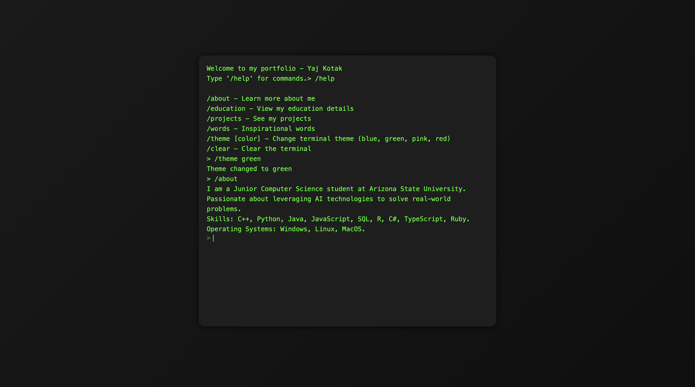

# Interactive Terminal Portfolio

This is an interactive terminal-style portfolio that showcases my education, projects, and personal details in a retro-style command-line interface. It includes customizable themes, command history, and fluid animations for a smooth and engaging user experience.

## Features
- **Typing Animation**: Text auto-types for an authentic terminal feel.
- **Commands**: Interactive commands to view sections like `/about`, `/education`, `/projects`, etc.
- **Dynamic Theme Switching**: Switch between different themes using `/theme [color]`.
- **Command History**: Scroll through previously entered commands with the arrow keys.
- **Smooth Scrolling**: Auto-scrolls to the latest content.
- **Custom Styling**: Modern UI with custom scrollbar and terminal styling.

## Available Commands
| Command      | Description                                             |
|--------------|---------------------------------------------------------|
| `/help`      | Lists available commands.                               |
| `/about`     | Shows information about me.                             |
| `/education` | Displays education details.                             |
| `/projects`  | Lists my projects with details.                         |
| `/words`     | Shows an inspirational quote.                           |
| `/theme [color]` | Changes the terminal theme (available: blue, green, pink, red). |
| `/clear`     | Clears the terminal window.                             |

## Installation

1. Clone the repository:
   ```bash
   git clone https://github.com/yourusername/portfolio-terminal.git
   ```
2. Open the `index.html` file in your browser to explore the terminal portfolio locally.

## Usage

Type `/help` in the terminal interface to see the available commands. You can explore different sections like "about", "projects", and more.

## Screenshots



## Technologies Used

- HTML
- CSS (Custom themes, modern UI)
- JavaScript (Dynamic interactions, theme switching)

## License

This project is licensed under the MIT License - see the [LICENSE](LICENSE) file for details.

## Contact

If you have any questions or feedback, you can reach me through the following methods:

  <a href="https://www.linkedin.com/in/yajkotak" target="_blank">
    
  </a>
